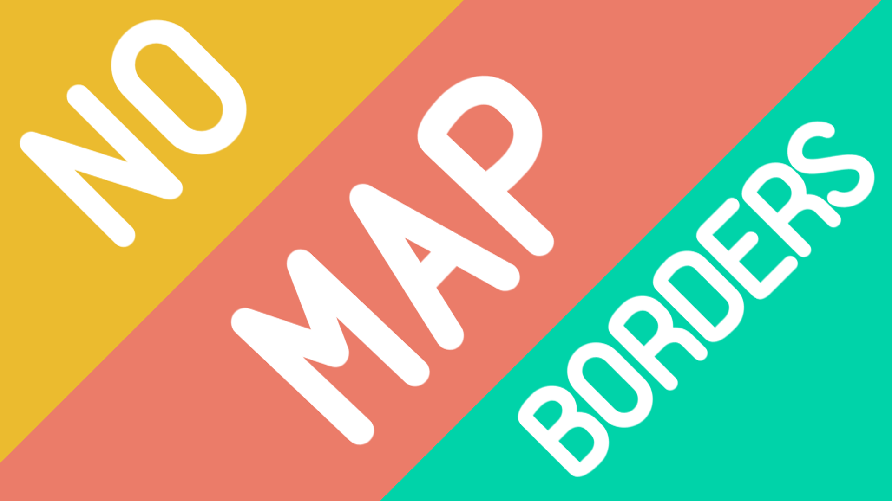
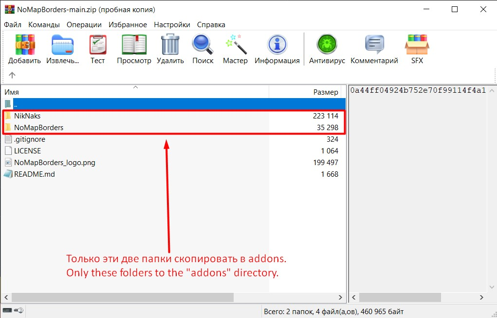

# NoMapBorders

Дополнение для Garry's Mod, которое предотвращает столкновение с границами игровых карт, позволяя бесконечно перемещаться в пространстве. Особенно полезно для полётов и некоторого наземного транспорта.

Версия: 0.9-alpha.

>Выполните команду «RemoveMapBorders» (без кавычек) в консоли, чтобы перезапустить расширение на карте.

>**Инструкция по установке:**

>Скачать архив в формате .ZIP, извлечь две находящихся в нём папки напрямую в директорию «addons». Папка «addons» располагается, как правило, по пути, где установлена Ваша игра, например: __`C:\Games\Garry's Mod\garrysmod\addons`__. В вашем случае директория, в которой установлена игра, может быть иной. 
>

Для работы расширения используется библиотека [NikNaks](https://github.com/Nak2/NikNaks) от разработчика [Nak2](https://github.com/Nak2/). Все права на библиотеку принадлежат оригинальному разработчику. 
_____________________
Garry's Mod addon that prevents collisions with the boundaries of game maps, allowing you to move endlessly in space. Especially useful for flying.
